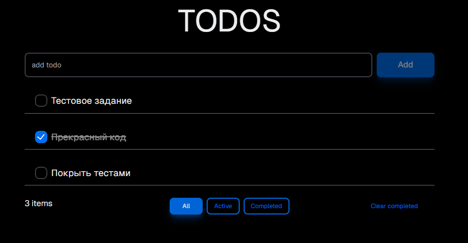

# Mindbox-todos



## Список дел, в котором реализованы:
 - Добавкение задачи
 - Изменеие статуса задачи
 - Фильтрация задач по статусу
 - Очистка выполененых задач

## Что использовал:
 - [Next](https://nextjs.org) — фреймворк для серверного рендеринга и статической генерации сайтов на React. Используется для создания высокопроизводительных веб-приложений с удобным роутингом и возможностью работы как на клиентской, так и на серверной стороне. 
 - [@reduxjs/toolkit](https://redux-toolkit.js.org/) — официальный инструмент для работы с [Redux](https://redux.js.org). Он упрощает настройку хранилища, создание редьюсеров и экшенов, а также предоставляет удобные утилиты для работы с асинхронными запросами.
 - [NextUI](https://nextui.org) — библиотека компонентов, обеспечивающая стилизованные и адаптивные интерфейсы для React-приложений.
 - [Jest](https://jestjs.io/ru) — тестовый фреймворк, который используется для написания и запуска юнит-тестов. 

## Запуск приложения:

```bash
npm run start
```


